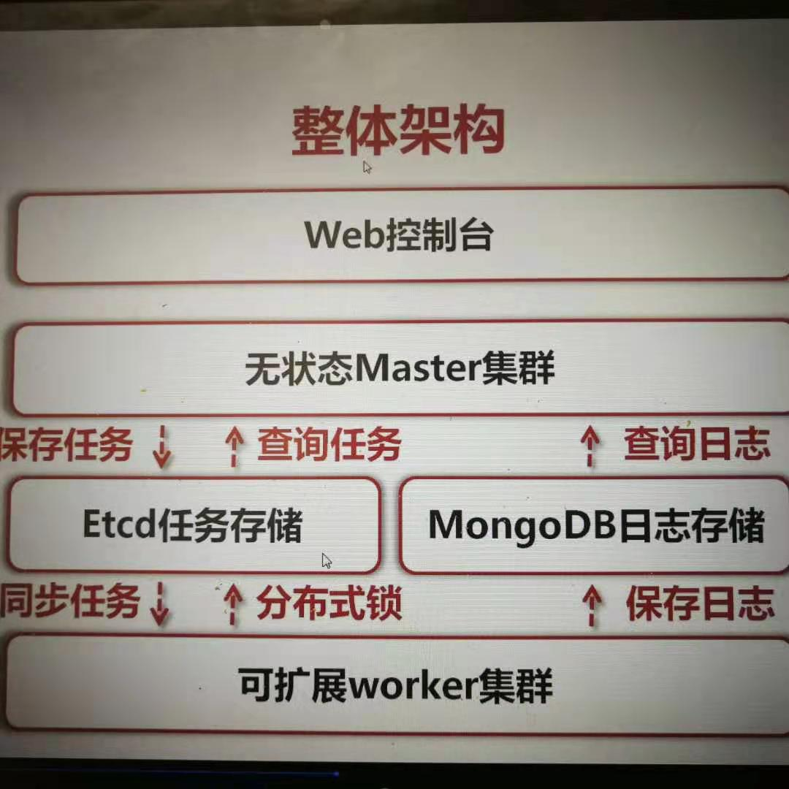
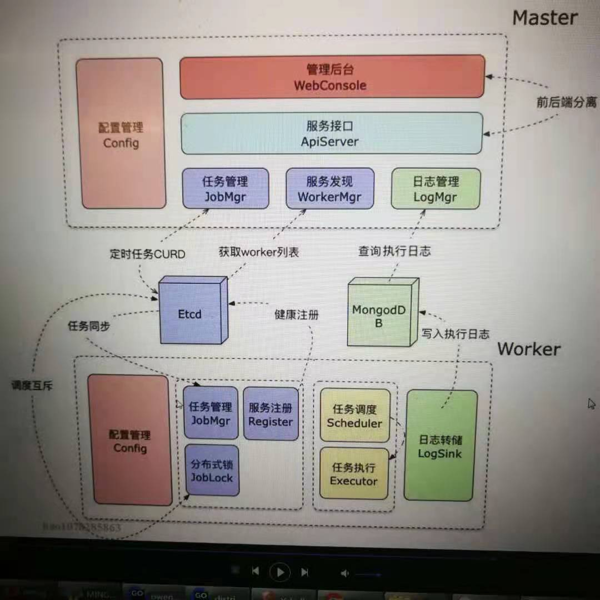

# 一、需求解读

## 1、1 需求概述


### 1、1、1 背景

传统的crontab任务调度存在以下缺点
1.机器故障，任务停止调度，设置crontab配置都找不回来（单机故障）
2.任务数量多，单机的硬件资源耗尽，需要人工的迁移到其他机器上（扩展性不好）
3.需要人工去机器上配置crontab规则，任务执行状态不方便查看（可通过配置中心来批量管理多台机器）
以上都是传统的crontab任务调度存在的痛点


### 1、1、2 开源项目调研

面上上现在有哪些开源项目和我要实现的功能是类似的

Elastic Job

XXL-JOB

light-task-scheduler(LTS)


## 1、2 功能需求

功能需求分为前端和后端两部分，下面我们分别阐述下。


### 1、2、1 web前端需求

  1）增加任务页面
  2）删除任务页面
  3）修改任务页面
  4）查询所有任务的页面
  5）查询任务执行日志（了解任务运行情况）
  6）查看worker集群中的健康节点
  7）强杀执行中的任务（force kill）

### 1、2、2 后端需求

  1）提供增加任务的http接口
  2）提供删除任务的http接口
  3）提供修改任务的http接口
  4）提供查询任务的http接口
  5）提供查询所有任务的http接口
  6）提供查询任务执行日志信息的http接口

# 二、概要设计

## 2、1 系统整体架构



1、Master集群

提供任务的增删改查服务，以及任务执行日志的查询,Master集群暴露这些操作api给web控制台来进行操作。
Master集群是无状态的，所以从哪个master节点来操作，都是一样的。

 

2、Worker集群

Worker集群从etcd中同步master下发的任务（所有Worker上都是同样的任务列表），执行任务，并将任务执行结果上传到mongodb数据库。


3、etcd任务存储

负责存储master下发的任务，如定时任务、强杀任务等，具体存储数据结构会在后面数据结构章节详细描述。


4、mongodb日志存储

保存任务执行日志：负责存储任务执行结果，便于用户了解任务的运行状态。

查询任务执行日志：提供接口给master集群来查询执行日志，最终将任务执行结果展示到web控制台。


5、分布式锁（重点）

此处采用etcd来实现分布式乐观锁。

当多个worker节点想同时执行一个任务时，需要通过etcd分布式乐观锁来实现一个任务只被一个worker节点执行。

确保一个任务在Worker集群中，不会被并发执行。每个worker利用分布式锁抢占，解决并发调度相同任务的问题。


备注：

利用etcd同步全量的任务列表到所有的worker节点

每个worker独立调度全量任务，无需与master产生直接RPC通信

各个worker利用分布式锁抢占，抢到锁的worker来执行到期的任务，解决并发调度相同任务的难题。

# 三、详细设计

详细设计分为Master集群设计、Worker集群设计、通用数据结构设计三部分



上图可以清晰的描述了Master的设计、Worker的设计，以及Master和Worker是如何跟Etcd、mongodb进行交互的。

## 3、1 Master设计

web管理页面：基于jquery + bootstrap的web控制台，实现前后端分离，静态页面和后端代码是分离开写的。

### 3、1、1 配置管理模块 Conig

### 3、1、2 服务接口模块 ApiServer

### 3、1、3 任务管理模块 JobMgr

任务管理HTTP接口：新建、删除、修改、查看任务
通过etcd操作/cron/jobs/目录，采用gin框架来实现。


任务控制HTTP接口：提供强制结束任务的接口（强杀）
通过向etcd的/cron/killer目录写入要强杀的任务名字，worker感知到此任务需要被强杀，执行强杀动作。

### 3、1、4 日志管理模块 LogMgr

任务日志HTTP接口：查看任务执行历史日志
从mongodb数据库的记录中，读取任务执行的结果生成的日志，在web前端进行展示。

### 3、1、5 服务发现模块 WorkerMgr

从etcd数据库中读取健康的worker节点列表。


## 3、2 Worker集群设计

### 3、2、1 功能模块划分

Worker集群根据功能模块划分为以下几种：

#### 1） 管理配置模块 Config

#### 2） 任务管理模块(JobMgr)

监听etcd中/cron/jobs目录的变化以及监听强杀任务目录的变化。

#### 3）任务调度模块(Schedler)

基于crontab表达式计算，并触发过期的任务。

任务调度模块是如何设计的？


#### 4）任务执行模块(Executor)

协程池并发执行多个任务，基于etcd分布式锁抢占，抢到锁的才进行执行

#### 5）执行日志转存存模块(LogSink)

捕获任务执行输出，将执行结果保存到Mongodb中

#### 6）服务注册模块(Register)

worker处于运行健康的状态时，将自身注册到etcd中，便于web前端显示出有哪些健康的worker节点


### 3、2、2 协程模型

根据各个功能的不同，可分为以下几个协程，

#### 1）监听协程

利用etcd watch api监听/cron/jobs和/cron/killer目录的变化
将变化的事件通过channel通知给调度协程，并更新内存中的任务信息

#### 2）调度协程

要做的事情包括以下几点：
1、监听任务变更event事件（如增删改查），并维护内存中的任务列表（etcd中任务的一个镜像）
2、检查cron表达式，扫描过期任务，交给执行协程去执行
3、监听任务控制事件event，强制中断正在执行中的子进程（通过context来取消任务）
4、监听任务执行result结果（执行成功or执行失败？），更新内存中的任务状态（未执行，执行中，执行成功，执行失败），投递执行日志到日志上报协程

#### 3）任务执行协程

在etcd中抢占分布式乐观锁，/cron/lock/任务名
抢占成功则通过Command类来执行shell命令
捕获Command输出并等待子进程结束，将执行结果重新投递给调度协程

#### 4）执行日志上报协程

数据源：调度协程将执行结果上报给日志协程
1、监听调度协程发来的执行日志，放入一个batch中，等待批量处理（批量插入可提高mongodb的吞吐量，一天天插入可能插入不过来）
2、对新batch启动定时器，超时未满自动提交。

3、若batch缓冲区已经满了，那么立即提交，并取消自动提交定时器。


## 3.3 通用数据结构

### 3、3、1 任务管理

struct jobMgr {
name string, //任务名
command string, //shell命令
cronExpr string, //crontab表达式
}
通过3.1部分的描述可知，向etcd中写入位置是/cron/jobs,key为任务名，value为json格式的jobMgr结构体。


worker节点监听/cron/jobs目录的所有变化，当master将指定任务写入到etcd的/cron/jobs目录后，内容会被实时同步到所有worker节点。


### 3、3、2 任务执行日志

任务日志是记录任务的执行情况，存储在mongodb数据库
{
  jobName,   //任务名
  command,   //shell命令
  err,    //任务执行报错
  output,   //任务执行输出
  startTime,  //开始时间
  endTime,   //结束时间,看出任务执行了多久
}
请求mongodb，按照任务名来查看最近的执行日志，我们只是先查看最近的N条日志。


### 3、3、3 强杀任务

etcd结构
/cron/killer/任务名 -> ""
master节点向etcd的/cron/killer目录下写入待强杀的任务，key为任务名，value为空。
worker节点会监听/cron/killer目录下的put修改操作
当master向/cron/killer目录下写入指定任务名时，相当于通知worker集群强杀这个任务。


3、3、4 任务变更事件

```go
type JobEvent struct {
   EventType int
   JobInfo   *Job
}
```

EventType：事件的类型

JobInfo: 任务的信息


# 四、任务拆分

## 4、1 强化基础知识，为做项目铺垫

1）cmd命令执行（已完成）

​	捕获命令执行的结果

​	取消命令的执行

2）crontab库的使用

3）etcd的使用（已完成）

​	watch操作 --prefix

​	get操作

​	put操作

​	delete操作

4）mongodb的使用（已完成）

​	单次插入数据

​	批量插入数据


# 五、不足

详细设计文档的模块设计还不够详细，需要再具体到模块应该要如何来进行设计。

 